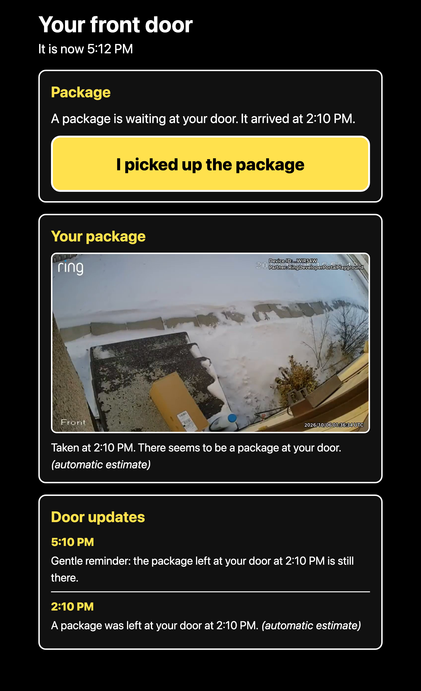
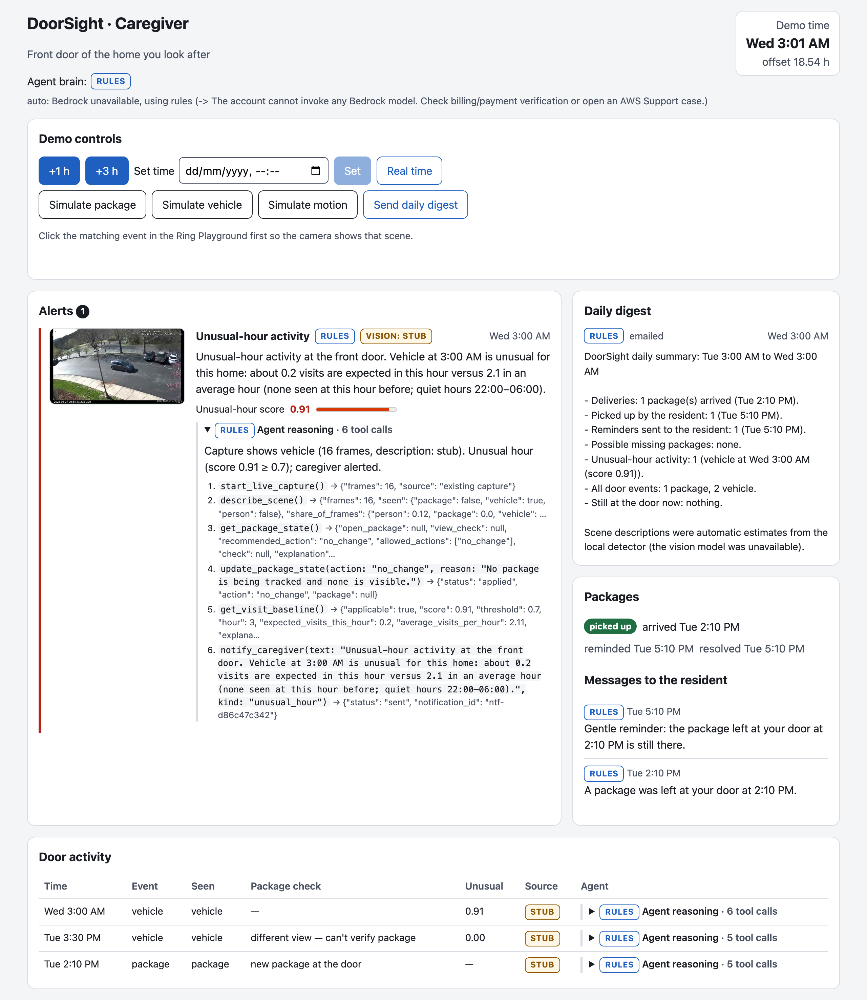

# DoorSight

A Ring doorstep assistant for elderly and low-vision residents. Each Ring event (motion, package, vehicle) starts an agent that looks at the live video, works out what is actually at the door, remembers state across events, and sends accessible updates to the resident and a short digest to a remote caregiver.

> Work in progress — built for the Amazon Developer Hackathon (Ring track + AWS Builder challenge).

## Status

- [x] Step 1 — FastAPI backend with the Ring console endpoints, Amazon Vision API client, webhook HMAC verification
- [x] Step 2 — WHEP live-video frame capture (aiortc, 1 frame/s, up to 20 s)
- [x] Step 3 — YOLO-World detection + Bedrock scene description (stub fallback when Bedrock is unavailable)
- [x] Step 4 — Doorstep state (SQLite), package lifecycle, unusual-hour scoring, demo clock
- [ ] Step 5 — Agent + caregiver alerts
- [x] Step 6 — Resident and caregiver web views (React + Vite, axe-checked)
- [ ] Step 7 — Full account linking flow
- [ ] Step 8 — Docs, architecture diagram, demo

## Quick start

```bash
python3.12 -m venv .venv && source .venv/bin/activate
pip install -r requirements.txt
cp .env.example .env   # fill in RING_CLIENT_ID, RING_CLIENT_SECRET, RING_HMAC_KEY, RING_ACCESS_TOKEN
pytest
python scripts/list_devices.py --include
uvicorn backend.main:app --port 8000
```

Expose it publicly (the Ring console needs HTTPS):

```bash
ngrok http --url=<your-static-domain>.ngrok-free.app 8000
```

## Endpoints

| Route | Ring console field | Purpose |
|-|-|-|
| `GET /link` | Account Link URL | Validates `time` (10 min window) and matches the `nonce` (HMAC-SHA256, URL-safe Base64, no padding) against stored unclaimed tokens |
| `GET /home` | App Homepage URL | Connection status |
| `POST /token` | Token Exchange URL | Receives the form-encoded auth code, exchanges it at `https://oauth.ring.com/oauth/token`, looks up the Account ID via `GET /v1/users/me`, stores tokens in `data/tokens.json` |
| `POST /webhook` | Webhook URL | Verifies `X-Signature: sha256=<hex>` over the raw body, returns 200 immediately, logs the payload to `logs/webhooks.jsonl` |
| `POST /simulate-event` | — | Dev trigger (`{"event_type": "package"\|"vehicle"\|"motion", "wait": false}`). Builds a v1.1-shaped event and runs it through the same handler as `/webhook`, which starts a WHEP capture to `data/frames/<event_id>/` |
| `POST /demo/clock` | — | Set or advance simulated time (`{"set": "2026-10-07T03:00"}`, `{"advance_hours": 3}`, `{"reset": true}`), then run reminders |
| `POST /packages/{id}/picked-up` | — | The resident's "I picked up the package" button |
| `GET /state` | — | Packages, queued notifications, recent events, demo clock |
| `GET /health` | — | Liveness |

## Frame capture

`backend/vision/capture.py` opens a video-only (`recvonly`) WHEP session on the device, saves one JPEG per second for up to 20 s, then closes the peer connection and DELETEs the session. The sandbox token is re-read from `.env` on each capture, so a regenerated token works without a restart.

Click the matching event (Package / Vehicle / Motion) in the Ring Playground first — it switches the clip the sandbox device streams.

```bash
curl -X POST localhost:8000/simulate-event -H 'Content-Type: application/json' -d '{"event_type":"package","wait":true}'
```

## Scene analysis

Each captured event is analysed into `data/analysis/<event_id>.json`:
- **YOLO-World** detections (cardboard box / package / parcel, person, car / truck / van) per frame, plus an event summary.
- A scene description from a vision model on **Amazon Bedrock** (`BEDROCK_MODEL_ID`, default Claude Haiku 4.5), returned as strict JSON with an `accessible_description` for the resident.
- If Bedrock is unavailable, a detector-only description marked `"source": "stub"`.

```bash
./scripts/check_bedrock.sh                                        # can this AWS account call Bedrock?
python scripts/analyze_event.py data/frames/<event_id>            # re-analyse an existing capture
```

## Demo story

```bash
python scripts/demo_story.py
```

Runs the story against real sandbox captures in a separate `data/demo.db`: package arrives (sim 2:10 PM) → clock +3 h → reminder → resident pickup → vehicle at sim 03:00 → unusual-hour caregiver alert.

## Web app

```bash
cd web && npm install && npm run dev      # http://localhost:5180 (proxies the backend on :8000)
npm run a11y                              # axe-core WCAG 2.2 A/AA check + screenshots in docs/screenshots/
```

- **`/resident`:** large text, high contrast, screen-reader first.
  - A feed of door updates and the latest picture; while a package is waiting, the picture of that package.
  - A large "I picked up the package" button, shown only when a package is waiting.
  - New updates are announced once through a polite live region.
  - After a pickup, focus moves to the package section.
- **`/caregiver`:** an alert feed with snapshot, explanation and unusual-hour score.
  - Every item has a source label: `bedrock`, `stub` or `rules`.
  - Packages, messages sent to the resident, and the door activity log.
  - Demo clock controls and buttons that trigger `/simulate-event`.

Both views poll `GET /state` every 3 s. To load the demo story into the live database for the UI:

```bash
python scripts/demo_story.py --db data/doorsight.db               # full story
python scripts/demo_story.py --db data/doorsight.db --until reminder  # package still waiting
```

| Resident | Caregiver |
|-|-|
|  |  |

## AWS

```bash
./scripts/aws_setup.sh --email you@example.com      # DynamoDB table, private S3 bucket, SNS topic (idempotent)
./scripts/aws_setup.sh --enable                     # also switch STATE_BACKEND=dynamodb, SNAPSHOT_BACKEND=s3
python scripts/demo_story.py --aws                  # run the story on DynamoDB + S3 + SNS
./scripts/aws_teardown.sh --dry-run                 # preview deleting everything; drop --dry-run to do it
```

| Service | Used for | Selected by |
|-|-|-|
| Amazon DynamoDB | events, packages, notifications (on-demand) | `STATE_BACKEND=dynamodb` |
| Amazon S3 | event snapshots (private, presigned URLs, 30-day expiry) | `SNAPSHOT_BACKEND=s3` |
| Amazon SNS | caregiver alert emails | `SNS_TOPIC_ARN` |
| Amazon Bedrock | scene descriptions (stub until account access is enabled) | `BEDROCK_MODEL_ID` |

## Credits

Ring sandbox live-view clips are stock footage licensed under CC BY 4.0 (full attribution to be added with the demo).

## License

MIT — see [LICENSE](LICENSE).
