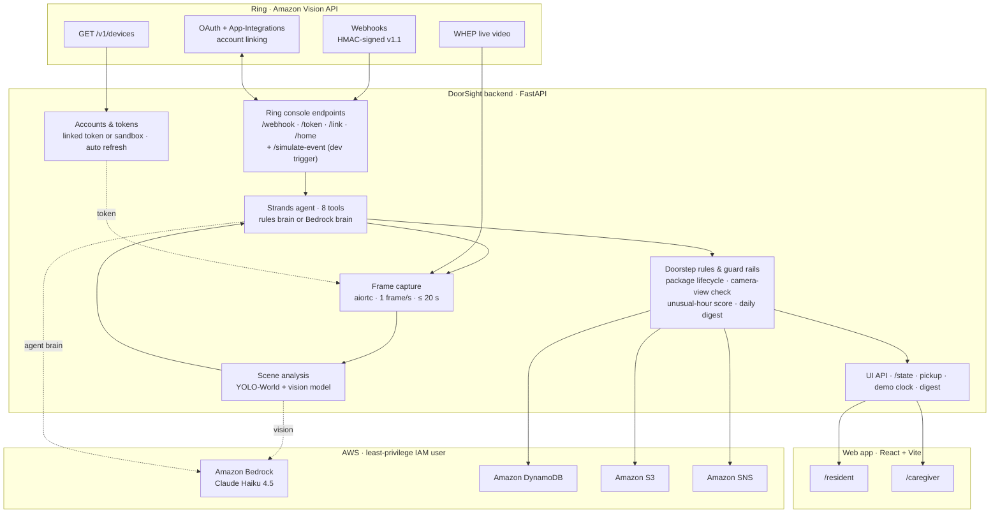

# DoorSight

**A Ring doorstep assistant for older and low-vision residents, and the family member who looks out for them.** Every Ring event (package, vehicle, motion) goes to an agent that opens the doorbell's live video, works out what is actually at the door, and remembers what happened before. A resident gets calm, large-text, screen-reader-friendly updates and a big "I picked up the package" button. A remote caregiver gets short, evidence-based alerts by email when something needs attention: a package that disappeared without being collected, or a car at the door at 3 AM. Every alert says *why*: the score, the camera-view check, the agent's tool calls. Every message says where its information came from, and the system never claims more certainty than its evidence supports.

> Built for the Amazon Developer Hackathon (Ring track + AWS Builder challenge). Demo video: _(link to add)_

| Resident view | Caregiver view |
|-|-|
|  |  |

## Judging criteria → features

> The four criteria names below follow the usual Devpost structure; check them against the hackathon rules page before submitting.

### 1. Technological implementation
- **Real Ring APIs at runtime:**
  - **Device discovery:** `GET /v1/devices` (`backend/ring/client.py`, `backend/events.py`).
  - **WHEP live video:** aiortc, video-only `recvonly`, 1 frame/s, sessions always closed with `DELETE` (`backend/vision/capture.py`).
  - **Webhooks:** HMAC-SHA256 signature verification over the raw body (`backend/ring/signatures.py`).
  - **One-way account linking:** nonce matching, App-Integrations `POST` + mandatory `PATCH`, token refresh (`backend/ring/accounts.py`).
- **Agent:** a Strands agent with 8 tools (`backend/agent/tools.py`) and two brains: deterministic rules, or Claude Haiku 4.5 on Bedrock (`backend/agent/brains.py`). The brain is chosen automatically at startup by `scripts/check_bedrock.sh`. Every tool call and the agent's reason are stored on the event.
- **Guard rails in code, not just the prompt:** the tools refuse unsafe actions. A capture from a different camera view can never mark a package missing; this is checked with perceptual-hash fingerprints (`backend/vision/fingerprint.py`, measured thresholds in `DECISIONS.md` D6). Alerts must match the package state.
- **Vision:** YOLO-World open-vocabulary detection for "cardboard box", "package", "parcel", "person", "car", "truck" and "van" (`backend/vision/detect.py`), plus a Bedrock vision description returned as validated strict JSON (`backend/vision/describe.py`).
- **Tests:** 261 pytest tests. These include store tests run against SQLite **and** DynamoDB (moto), and an agent loop driven by a scripted fake model (`tests/fakes.py`). Account linking is tested against a fake Ring OAuth/API server (`tests/fake_ring.py`).

### 2. Design and user experience
- **`/resident` (`web/src/pages/Resident.tsx`):**
  - **Look:** white on black, 24 px base text, a 120 px tall "I picked up the package" button shown only when a package is waiting, and the photo of the waiting package.
  - **Screen readers:** new updates are announced once through a polite live region, and focus moves sensibly after the button disappears.
  - **Checked:** 0 axe-core violations (WCAG 2.2 A/AA) at desktop and phone width (`web/scripts/a11y-and-screenshots.mjs`).
- **`/caregiver` (`web/src/pages/Caregiver.tsx`):**
  - **Alerts:** each has a snapshot, plain-language explanation, unusual-hour score and the agent's tool calls.
  - **Source labels:** every item is labelled `bedrock`, `stub` or `rules`, so an automatic estimate is never passed off as a vision-model answer.
  - **Digest and demo controls:** the daily digest, plus a demo clock and buttons for running a demo.
- **Language:** messages to the resident are calm and short ("Gentle reminder: the package left at your door at 2:10 PM is still there."). Messages to the caregiver quote their evidence.

### 3. Potential impact
- **The problem:** missed or stolen deliveries, and not knowing who came to the door, hit people with low vision or reduced mobility hardest. Their caregivers are often far away.
- **What it does about it:**
  - **Collect the package:** an arrival message and a gentle reminder 3 hours later (`backend/doorstep.py`).
  - **Possible-theft alert:** only when the *same camera view* shows the package gone and nobody marked it picked up.
  - **Unusual-hour alerts:** scored against this home's own visit pattern (`config/visit_profile.json`).
  - **Daily digest:** a summary for the caregiver by email.
- **Any Ring doorbell:** it works through standard Ring APIs, with no extra hardware.

### 4. Quality of the idea
- **Ring events become household context:** what's at the door now, what happened earlier, and whether this hour is normal for this home.
- **Two audiences, two voices:** the resident needs reassurance and one clear action; the caregiver needs evidence. The same events produce both.
- **Honest by design:** the source labels, the camera-view check and the "no reference view, can't verify" outcomes keep the system from claiming certainty it doesn't have.

### AWS Builder challenge

| Service | How DoorSight uses it | Code |
|-|-|-|
| Amazon Bedrock | Vision description (strict JSON) and the agent brain, Claude Haiku 4.5, via Converse / Strands `BedrockModel` | `backend/vision/describe.py`, `backend/agent/brains.py` |
| Strands Agents | Agent loop with 8 tools, fallback and timeout handling | `backend/agent/` |
| Amazon DynamoDB | Events, packages, notifications and linked-account tokens. On-demand, strongly consistent single-table design | `backend/store/dynamodb.py` |
| Amazon S3 | Event snapshots: private bucket, SSE-S3, 30-day expiry, 1-hour presigned URLs for the UI | `backend/snapshots.py` |
| Amazon SNS | Caregiver alert emails and the daily digest | `backend/notify.py` |
| AWS IAM | The server runs as `doorsight-app`, a least-privilege user (policy below) | `docs/iam/doorsight-app-policy.json` |

The server never uses root credentials. Its IAM user can only touch the DoorSight table, the snapshot objects, the caregiver topic and the two Bedrock models it calls. Listing buckets, tables or topics, deleting objects, and anything in IAM are all denied (verified):

```json
{ "Sid": "StateTable",       "Action": ["dynamodb:GetItem","dynamodb:PutItem","dynamodb:DeleteItem","dynamodb:Query","dynamodb:BatchWriteItem"], "Resource": "…:table/doorsight-state" },
{ "Sid": "SnapshotObjects",  "Action": ["s3:PutObject","s3:GetObject"], "Resource": "arn:aws:s3:::doorsight-snapshots-<account>/frames/*" },
{ "Sid": "CaregiverAlerts",  "Action": "sns:Publish", "Resource": "…:doorsight-caregiver-alerts" },
{ "Sid": "BedrockModels",    "Action": ["bedrock:InvokeModel","bedrock:InvokeModelWithResponseStream"], "Resource": ["Claude Haiku 4.5 + Nova Lite inference profiles and models"] }
```

## What's real and what's simulated

| Part | Status |
|-|-|
| Ring device discovery (`GET /v1/devices`) | **Real**, against the Ring sandbox ("Playground Device") |
| Live video capture (WHEP) | **Real**: frames are captured from the sandbox stream. The sandbox streams stock clips; the Playground's Package / Vehicle / Motion buttons switch the clip |
| Ring webhooks | **Simulated.** The Playground buttons don't send webhooks (friction F9), so `POST /simulate-event` builds the same v1.1 payload and runs it through the same handler. Signature verification is implemented and tested |
| Account linking (one-way) | **Implemented, verified against a fake Ring server** (53 tests). Live linking needs a Ring Protect plan or trial (friction F12); until then the app uses the sandbox token |
| Object detection (YOLO-World) | **Real**, runs locally on the captured frames |
| Bedrock vision + agent brain | **Code complete, not yet live.** This AWS account can't invoke any Bedrock model yet (support case open). The rules brain and a clearly labelled `stub` description are used instead; the switch is automatic once `scripts/check_bedrock.sh` passes |
| DynamoDB, S3, SNS | **Real**, verified live under the least-privilege IAM user |
| Time | **Simulated for demos:** a demo clock (`DEMO_TIME_OFFSET`, `POST /demo/clock`) lets the story jump to 3 AM or skip 3 hours. Every event stores both real and simulated time |

## Architecture



The rendered version, with file paths, is [docs/architecture.png](docs/architecture.png); its source is [docs/architecture.mmd](docs/architecture.mmd). Design decisions and measured thresholds are in [DECISIONS.md](DECISIONS.md).

**Event flow:**
1. A webhook (or `/simulate-event`) reaches the agent.
2. The agent runs `start_live_capture` → `describe_scene` → `get_package_state` → `update_package_state` → `get_visit_baseline` → `notify_resident` / `notify_caregiver`. Every step is recorded on the event.
3. Resident messages appear in `/resident`; caregiver alerts are also emailed through SNS.

## Run it

**Prerequisites:**
- Python 3.12, Node 20+ and Chrome (only for the accessibility check).
- A Ring developer account with an app (Client ID, Client Secret, HMAC key).
- Optionally: an ngrok static domain and an AWS account.

**1. Install and configure**
```bash
git clone https://github.com/arnavgupta2004/RingCare.git && cd RingCare
python3.12 -m venv .venv && source .venv/bin/activate
pip install -r requirements.txt
cp .env.example .env
```
In `.env`, fill in `RING_CLIENT_ID`, `RING_CLIENT_SECRET` and `RING_HMAC_KEY`. For `RING_ACCESS_TOKEN`, generate a sandbox OAuth token in the Ring developer console; it lasts 30 minutes and is re-read on every call, so you can refresh it without restarting.

**2. Check Ring access and run the tests**
```bash
python scripts/list_devices.py --include      # should list "Playground Device"
pytest                                        # 261 tests, no network or AWS needed
```

**3. Run the backend** (SQLite and local files by default; no AWS needed)
```bash
uvicorn backend.main:app --port 8000
```

**4. Run the web app** at http://localhost:5180/resident and http://localhost:5180/caregiver:
```bash
cd web && npm install && npm run dev
```

**5. Play the demo story** without waiting for real time. It replays real sandbox captures through the agent and finishes with the daily digest:
```bash
python scripts/demo_story.py --db data/doorsight.db                   # full story, shown in the web app
python scripts/demo_story.py --db data/doorsight.db --until reminder  # stop with a package waiting
```

**6. Trigger a live capture.** First click the matching event (Package / Vehicle / Motion) in the Ring Playground, then either use the caregiver view's "Simulate" buttons or:
```bash
curl -X POST localhost:8000/simulate-event -H 'Content-Type: application/json' -d '{"event_type":"package","wait":true}'
```

**7. Ring console endpoints** (optional; the console requires HTTPS):
```bash
ngrok http 8000 --url https://<your-static-domain>
```
Set these in the console's Account linking form:
- **Account Link URL:** `https://<domain>/link`
- **App Homepage URL:** `https://<domain>/home`
- **Token Exchange URL:** `https://<domain>/token`
- **Webhook URL:** `https://<domain>/webhook`

The sign-in on `/link` uses one demo user; set its password with `python scripts/set_demo_password.py`.

**8. AWS backends** (optional):
```bash
./scripts/aws_setup.sh --email you@example.com --enable   # table, private bucket, topic; switches .env to DynamoDB + S3
./scripts/aws_iam_setup.sh                                # least-privilege user doorsight-app, AWS_PROFILE=doorsight
./scripts/check_bedrock.sh                                # can this account call Bedrock?
python scripts/demo_story.py --aws                        # the story on DynamoDB + S3 + SNS
./scripts/aws_teardown.sh --dry-run                       # preview deleting all of it
```
`aws_setup.sh` and `aws_iam_setup.sh` need admin credentials; the server itself only ever uses the restricted profile. Caregiver emails start once the SNS subscription email is confirmed.

## Endpoints

| Route | Ring console field | Purpose |
|-|-|-|
| `GET/POST /link` | Account Link URL | Checks `time` (10 min window), requires DoorSight sign-in, matches the `nonce` (HMAC-SHA256, URL-safe Base64) to an unclaimed token, confirms with Ring (POST + PATCH app-integrations) |
| `POST /token` | Token Exchange URL | Exchanges the form-encoded auth code, reads the account ID from `GET /v1/users/me`, stores the tokens |
| `GET /home` | App Homepage URL | Linked status; after sign-in: Ring account ID, token expiry, token source, Disconnect |
| `POST /webhook` | Webhook URL | Verifies `X-Signature: sha256=<hex>`, returns 200 immediately, handles the event in the background |
| `POST /simulate-event` | — | Dev trigger: same payload shape and handler as a webhook |
| `POST /digest` | — | Agent writes and sends the caregiver's daily digest |
| `POST /demo/clock` | — | Set or advance simulated time, then run reminders |
| `POST /packages/{id}/picked-up` | — | The resident's "I picked up the package" button |
| `GET /state` | — | Everything the web app shows |
| `GET /health` | — | Liveness |

## Repository layout

```
backend/
  main.py             FastAPI app and routes
  events.py           webhook normalisation, live capture, hand-off to the agent
  agent/              Strands agent: tools, rules / Bedrock brains, runner, prompts
  doorstep.py         package lifecycle, guard rails, unusual-hour score, digest
  ring/               Ring client, HMAC signatures, accounts and token refresh
  vision/             WHEP capture, YOLO-World, Bedrock vision, camera-view fingerprints
  store/              StateStore interface: SQLite and DynamoDB implementations
  snapshots.py        local or S3 snapshots
  notify.py           SNS or log delivery
  auth.py             demo-user sign-in for account linking
web/                  React + Vite resident and caregiver views
scripts/              demo story, AWS setup/IAM/teardown, Bedrock check, tools
tests/                261 tests, fake Ring server, scripted fake model
docs/                 architecture, IAM policy, screenshots, product feedback, feature requests
DECISIONS.md          design decisions with measurements
FRICTION_LOG.md       developer-experience friction, ordered by severity
```

## Credits

The Ring sandbox live-view clips are stock footage licensed under [CC BY 4.0](https://creativecommons.org/licenses/by/4.0/). Frames from them appear in the screenshots and the demo video.

| Clip (as streamed by the sandbox) | Title, author, source | License |
|-|-|-|
| Snowy bird feeders (default view) | _(to fill in)_ | CC BY 4.0 |
| Front step with a parcel ("Package") | _(to fill in)_ | CC BY 4.0 |
| Parking lot and driveway ("Vehicle") | _(to fill in)_ | CC BY 4.0 |

## License

MIT — see [LICENSE](LICENSE).
